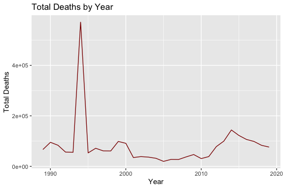
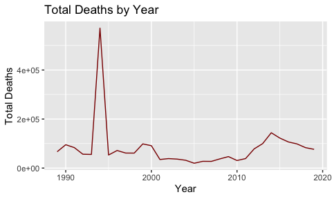

<!-- README.md is generated from README.Rmd. Please edit that file -->

# ucdp

<!-- badges: start -->

[](https://github.com/mcgirjau/ucdp/actions)
<!-- badges: end -->

R data package for the [Uppsala Conflict Data
Program](https://ucdp.uu.se/downloads/)

## Installation

You can install the development version of `ucdp` from
[GitHub](https://github.com/) with:

``` r
# install.packages("devtools")
devtools::install_github("mcgirjau/ucdp")
```

## Usage

Load the package in your R session with:

``` r
library(ucdp)
```

Use the `GED` dataset as-is, or load it explicitly into your environment
using:

``` r
data("GED")
```

## Examples

The following are some examples of questions that the Georeferenced
Event Dataset may help investigate.

### How does the number of total conflict fatalities vary from 1989 to 2019?

Let’s make a time series plot to visualize how the number of total
deaths varies by year.

``` r
library(dplyr)
library(ggplot2)
library(kableExtra)
library(tidyr)

GED %>%
  group_by(year) %>% 
  summarize(total_deaths = sum(best)) %>% 
  ggplot(aes(x = year, y = total_deaths)) + 
  geom_line(color = "darkred") +
  labs(x = "Year", y = "Total Deaths", title = "Total Deaths by Year")
```



Notice the very dramatic peak in total fatalities around 1994. Was that
a tumultuous year for the entire world, or was there a single event that
produced such a large volume of deaths? Let’s add region to our graph in
order to find out:

``` r
GED %>%
  group_by(year, region) %>% 
  summarize(total_deaths = sum(best)) %>% 
  ggplot(aes(x = year, y = total_deaths, color = region)) + 
  geom_line() +
  labs(x = "Year", y = "Total Deaths", color = "Region", title = "Total Deaths by Year") +
  theme(legend.position = "bottom")
```



Seems like the 1994 peak in total fatalities was due to some African
conflict. By comparison, that same year was relatively non-lethal for
all other regions.

Notice how conflicts in Africa used to produce a large volume of deaths
until around 2001, after which things began to calm down. Conflicts in
Asia, Europe, and the Americas have produced very few deaths from 1989
to 2019, and conflicts in the Middle East region used to follow the same
pattern until around 2011, when a sudden surge in fatalities can be
observed. That surge peaked around 2014, and conflict fatalities in the
region have been decreasing steadily since, almost reaching pre-2011
levels in 2019.

### Which 10 countries sustained the most conflict fatalities from 1989 to 2019?

``` r
GED %>%
  group_by(country) %>% 
  summarize(total_deaths = sum(best)) %>% 
  arrange(desc(total_deaths)) %>%
  head(10) %>%
  kable(col.names = c("Country", "Total Fatalities"),
        caption = "Top 10 Countries by Total Conflict Fatalities from 1989 to 2019") %>%
  kable_styling(latex_options = c("striped", "HOLD_position"))
```

<table class="table" style="margin-left: auto; margin-right: auto;">

<caption>

Top 10 Countries by Total Conflict Fatalities from 1989 to 2019

</caption>

<thead>

<tr>

<th style="text-align:left;">

Country

</th>

<th style="text-align:right;">

Total Fatalities

</th>

</tr>

</thead>

<tbody>

<tr>

<td style="text-align:left;">

Rwanda

</td>

<td style="text-align:right;">

543176

</td>

</tr>

<tr>

<td style="text-align:left;">

Syria

</td>

<td style="text-align:right;">

359843

</td>

</tr>

<tr>

<td style="text-align:left;">

Afghanistan

</td>

<td style="text-align:right;">

257944

</td>

</tr>

<tr>

<td style="text-align:left;">

Ethiopia

</td>

<td style="text-align:right;">

178169

</td>

</tr>

<tr>

<td style="text-align:left;">

Iraq

</td>

<td style="text-align:right;">

121659

</td>

</tr>

<tr>

<td style="text-align:left;">

DR Congo (Zaire)

</td>

<td style="text-align:right;">

114859

</td>

</tr>

<tr>

<td style="text-align:left;">

Sudan

</td>

<td style="text-align:right;">

93128

</td>

</tr>

<tr>

<td style="text-align:left;">

Sri Lanka

</td>

<td style="text-align:right;">

65628

</td>

</tr>

<tr>

<td style="text-align:left;">

Nigeria

</td>

<td style="text-align:right;">

57032

</td>

</tr>

<tr>

<td style="text-align:left;">

India

</td>

<td style="text-align:right;">

56716

</td>

</tr>

</tbody>

</table>

### What were the deadliest conflicts in each region from 1989 to 2019?

``` r
GED %>%
  group_by(region, conflict_name) %>% 
  summarize(total_deaths = sum(best)) %>% 
  slice_max(order_by = total_deaths, n = 1) %>%
  kable(col.names = c("Region", "Conflict", "Total Fatalities"),
        caption = "Most Lethal Conflict by Region") %>%
  kable_styling(latex_options = c("striped", "HOLD_position"))
```

<table class="table" style="margin-left: auto; margin-right: auto;">

<caption>

Most Lethal Conflict by Region

</caption>

<thead>

<tr>

<th style="text-align:left;">

Region

</th>

<th style="text-align:left;">

Conflict

</th>

<th style="text-align:right;">

Total Fatalities

</th>

</tr>

</thead>

<tbody>

<tr>

<td style="text-align:left;">

Africa

</td>

<td style="text-align:left;">

Government of Rwanda - Civilians

</td>

<td style="text-align:right;">

534213

</td>

</tr>

<tr>

<td style="text-align:left;">

Americas

</td>

<td style="text-align:left;">

Colombia: Government

</td>

<td style="text-align:right;">

19954

</td>

</tr>

<tr>

<td style="text-align:left;">

Asia

</td>

<td style="text-align:left;">

Afghanistan: Government

</td>

<td style="text-align:right;">

229878

</td>

</tr>

<tr>

<td style="text-align:left;">

Europe

</td>

<td style="text-align:left;">

Russia (Soviet Union): Chechnya

</td>

<td style="text-align:right;">

18196

</td>

</tr>

<tr>

<td style="text-align:left;">

Middle East

</td>

<td style="text-align:left;">

Syria: Government

</td>

<td style="text-align:right;">

251210

</td>

</tr>

</tbody>

</table>

### What were the most intentionally-lethal actors (i.e. actors not targetting civilians) on the world stage from 1989 to 2019?

``` r
GED %>%
  select(side_a, side_b, deaths_a, deaths_b) %>%
  pivot_longer(cols = c(side_a, side_b), names_to = "side_id", values_to = "side_name") %>%
  mutate(deaths_inflicted = ifelse(side_id == "side_a", deaths_b, deaths_a)) %>%
  group_by(side_name) %>% 
  summarize(total_deaths_inflicted = sum(deaths_inflicted)) %>% 
  arrange(desc(total_deaths_inflicted)) %>%
  head(10) %>%
  kable(col.names = c("Actor", "Total Deaths Inflicted"),
        caption = "Top 10 Actors by Most Deaths Inflicted from 1989 to 2019") %>%
  kable_styling(latex_options = c("striped", "HOLD_position"))
```

<table class="table" style="margin-left: auto; margin-right: auto;">

<caption>

Top 10 Actors by Most Deaths Inflicted from 1989 to 2019

</caption>

<thead>

<tr>

<th style="text-align:left;">

Actor

</th>

<th style="text-align:right;">

Total Deaths Inflicted

</th>

</tr>

</thead>

<tbody>

<tr>

<td style="text-align:left;">

Government of Afghanistan

</td>

<td style="text-align:right;">

136781

</td>

</tr>

<tr>

<td style="text-align:left;">

Syrian insurgents

</td>

<td style="text-align:right;">

102555

</td>

</tr>

<tr>

<td style="text-align:left;">

Government of Syria

</td>

<td style="text-align:right;">

85091

</td>

</tr>

<tr>

<td style="text-align:left;">

IS

</td>

<td style="text-align:right;">

47671

</td>

</tr>

<tr>

<td style="text-align:left;">

Government of Iraq

</td>

<td style="text-align:right;">

45135

</td>

</tr>

<tr>

<td style="text-align:left;">

EPLF

</td>

<td style="text-align:right;">

42900

</td>

</tr>

<tr>

<td style="text-align:left;">

EPRDF

</td>

<td style="text-align:right;">

39893

</td>

</tr>

<tr>

<td style="text-align:left;">

Government of Sri Lanka

</td>

<td style="text-align:right;">

37831

</td>

</tr>

<tr>

<td style="text-align:left;">

Taleban

</td>

<td style="text-align:right;">

34561

</td>

</tr>

<tr>

<td style="text-align:left;">

Government of Turkey

</td>

<td style="text-align:right;">

25461

</td>

</tr>

</tbody>

</table>
